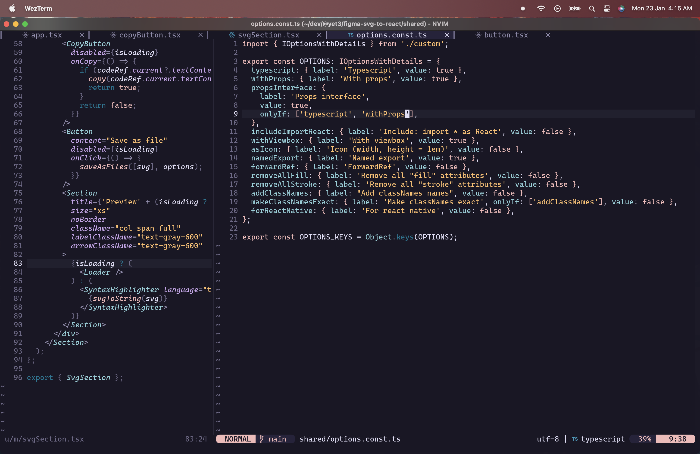
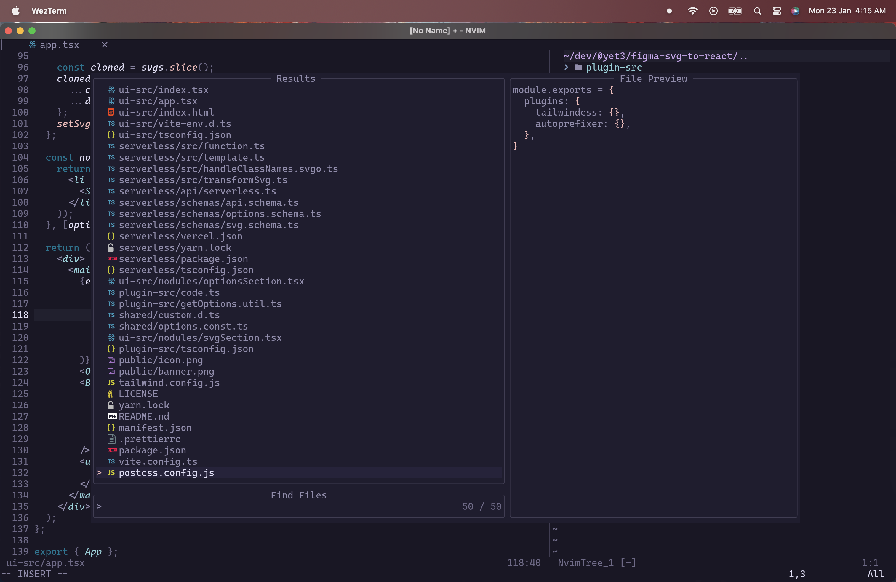

# Dotfiles

- shell: zsh
- shell-prompt: [Starship](https://github.com/starship/starship)
- terminal: [Kitty](https://sw.kovidgoyal.net/kitty/quickstart/)
  - [tmux](https://github.com/tmux/tmux)
- editor: [Neovim](https://github.com/neovim/neovim)
- fonts: [Caskaydia Cove Nerd Font](https://www.nerdfonts.com/font-downloads), [Victor Mono](https://rubjo.github.io/victor-mono/)

## Kitty
Config: 
- [starship.toml](./starship.toml)
- [kitty/kitty.conf](./kitty/kitty.conf)
- [tmux/tmux.conf](./tmux/tmux.conf)

## Neovim
Config: [nvim/init.lua](./nvim/init.lua)

