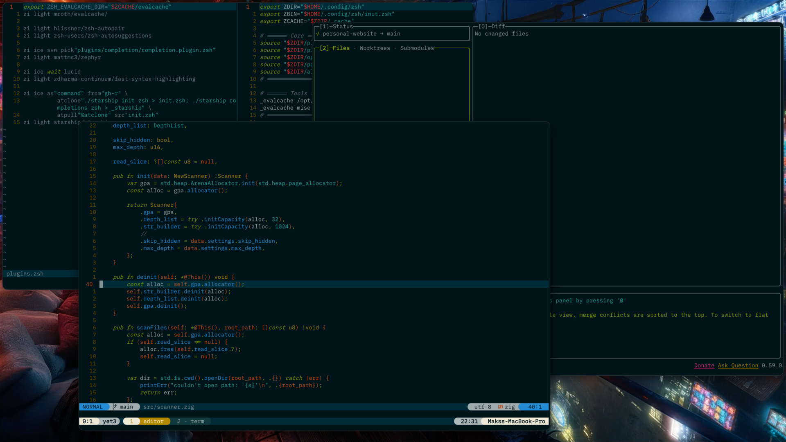

# Dotfiles



My personal dotfiles. 

**Use at your own discretion!**

Create symlinks
```sh
./dotfiles.sh setup
```

Remove symlinks
```sh
./dotfiles.sh cleanup
```

## Stuff I Use
- [Ghostty](https://ghostty.org/) - Terminal
- [Zsh](https://www.zsh.org/) - Shell
    - [zinit](https://github.com/zdharma-continuum/zinit) - Zsh plugin manager
        - [starship/starship](https://github.com/starship/starship) - Prompt
        - [mroth/evalcache](github.com/mroth/evalcache) - Eval cache
        - [hlissner/zsh-autopair](https://github.com/hlissner/zsh-autopair) - Autopairs
        - [zsh-users/zsh-autosuggestions](https://github.com/zsh-users/zsh-autosuggestions) - Zsh suggestions
        - [mattmc3/zephyr/plugins/completion](https://github.com/mattmc3/zephyr/tree/main/plugins/completion) - Zsh completions
        - [zdharma-continuum/fast-syntax-highlighting](https://github.com/zdharma-continuum/fast-syntax-highlighting) - Zsh syntax highlighting
    - [Eza](https://github.com/eza-community/eza) - ``ls`` replacement
- [Tmux](https://github.com/tmux/tmux/wiki) - Terminal multiplexer
    - [tmux-plugins/tpm](https://github.com/tmux-plugins/tpm) - Tmux plugin manager
    - [omerxx/tmux-sessionx](https://github.com/omerxx/tmux-sessionx) - Sessions manager
- [Neovim](https://neovim.io/) - Editor
    - [Plugins](./nvim/lua/plugins/) - Plugins' directory
- [Mise](https://mise.jdx.dev/) - Tool version manager
- [Git](https://git-scm.com/) - Version control
    - [Lazygit](https://github.com/jesseduffield/lazygit) - TUI for git
- [Hammerspoon](https://www.hammerspoon.org/) - MacOS automation tool
- [Theme](https://github.com/craftzdog/solarized-osaka.nvim) - Solarized Osaka
- [Font](https://lilex.myrt.co/) - Lilex
- [Wallpaper](https://www.reddit.com/r/cyberpunkgame/comments/bytih2/cyberpunk_2077_night_city_wallpaper_4k/) - Cyberpunk 2077 Night City Wallpaper

## About Me
- [Me, myself, and I](https://www.maxkasperowicz.com)
- [Projects](https://www.maxkasperowicz.com/projects)
